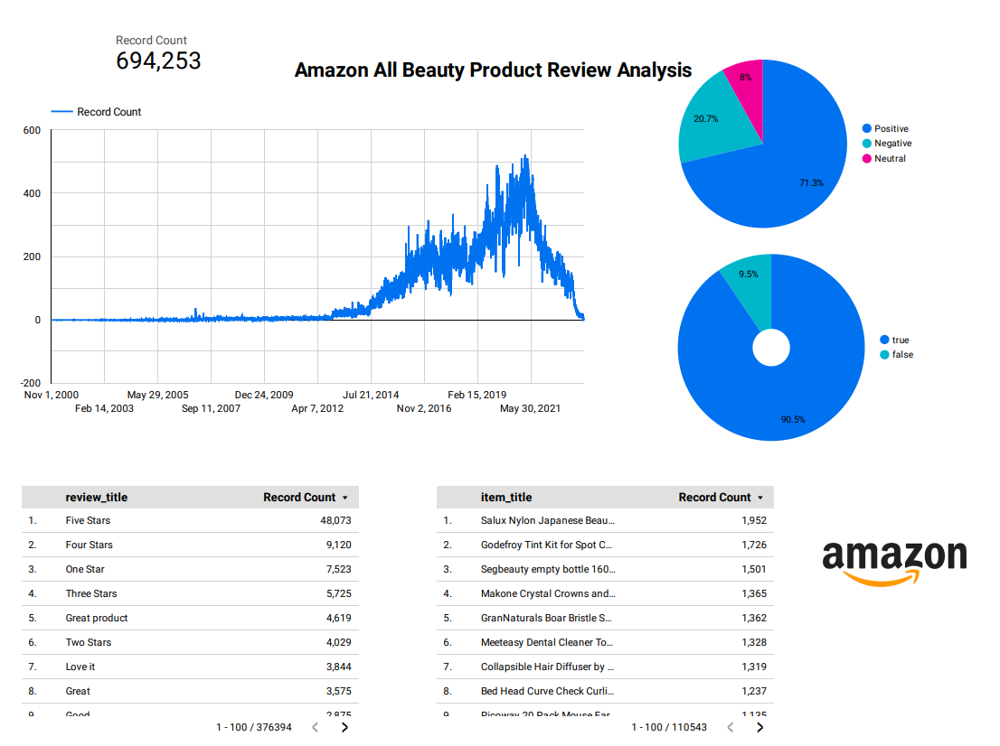
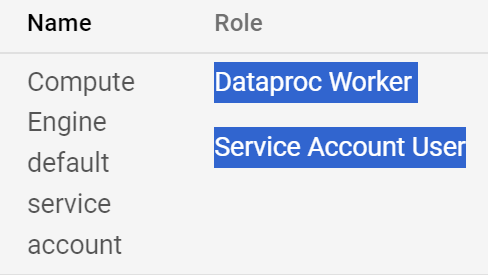
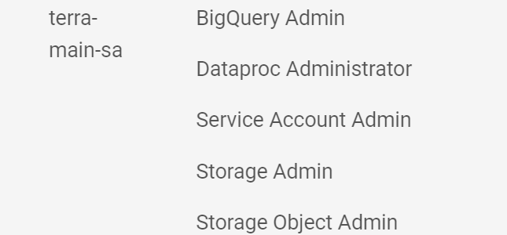
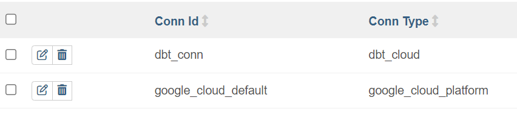

# AmazonProductReviewAnalysisPipeline
An end-to-end data engineering project using an ELT data pipeline to analyze Amazon Product Reviews, focusing specifically on All Beauty categories.

## Problem description
E-commerce platforms like Amazon have a vast accumulation of product reviews, which are pivotal in shaping the buying decisions of customers. These reviews are not only reflections of customer satisfaction but also serve as a rich data source for deriving insights about product preferences, customer sentiments, and market trends.

## Technologies
Cloud: GCP
Infrastructure as code (IaC): Terraform
Workflow orchestration: Airflow
Data Warehouse: BigQuery
Batch processing: Spark

## Dataset Citation  

@article{hou2024bridging,
  title={Bridging Language and Items for Retrieval and Recommendation},
  author={Hou, Yupeng and Li, Jiacheng and He, Zhankui and Yan, An and Chen, Xiusi and McAuley, Julian},
  journal={arXiv preprint arXiv:2403.03952},
  year={2024}
}
[data website](https://amazon-reviews-2023.github.io/)

## Dashboard

View at  https://lookerstudio.google.com/reporting/37325c7a-0fd9-4e66-a589-f676c3ba851b

## Reproducibility

Requirements:
1. Terraform 
2. GCP 
   1. Dataproc 
   2. IAM
   3. Big Query 
   4. Google Cloud Storage
3. Spark  
   1. Java 
   2. Hadoop 
4. Python 
5. venv(recommand)
6. [Airflow](https://docs.astronomer.io/astro/cli/get-started-cli)
   1. Docker
   2. Astro Cli
7. dbt Cloud 
   
  
### GCP 
1. Create a project and setup [service account](image.png)
2. Enable Dataproc/Big Query API
3. Ensure roles in IAM as shown below: 
   1. 
   2. 
   3. Possible Issue - IAM issue:https://cloud.google.com/data-fusion/docs/how-to/granting-service-account-permission

### Terraform 
   
1.  setup terraform 
   1. add cred in JSON from gcp with name creds_gcp_terraform_SA.json in `terraform\keys\creds_gcp_terraform_SA.json`
2.  `terraform fmt` check terra files 
3.  `terraform init` start init env/setup 
4.  In `terraform\terraform.tfvars`, fill with 
    1.  dbt_account_id =      (number)  -- account id 
    2.  dbt_token      = ""   (string)  -- personal token will be enough
    3.  dbt_host_url   = ""   (string)  -- Access URLs + "/api"
5.  `terraform plan` perfom actions 
6.  `terraform apply` deploy
7.  `terraform destroy` destroy, to get rid of the recources --> after finishing the whole project 

After `terraform apply`, Please also run `terraform output --json`, and copy the conent in the info.json located in `astro\include\terra_confi\info.json`

### Airflow
1. `astro dev init` skip 
1. `astro dev start` after it, visit webserver at https://localhost:8080/.
2. in admin --> connections add the following conn
   1.  better to keep the Conn Id the same as the image
3. `astro dev stop` after finishing the whole project 

### dbt Cloud 
1. get the account
2. find creds info needed in the previous steps 
   
### Lookder
View at  https://lookerstudio.google.com/reporting/37325c7a-0fd9-4e66-a589-f676c3ba851b
